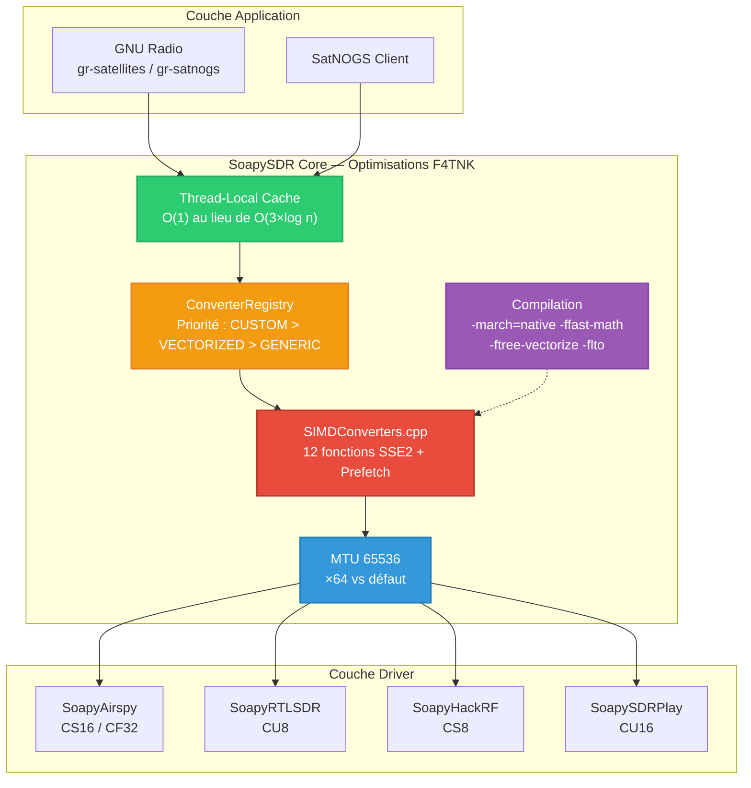
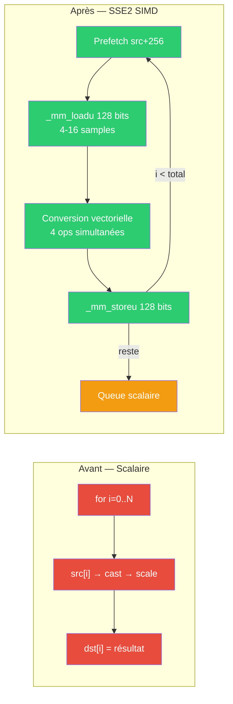
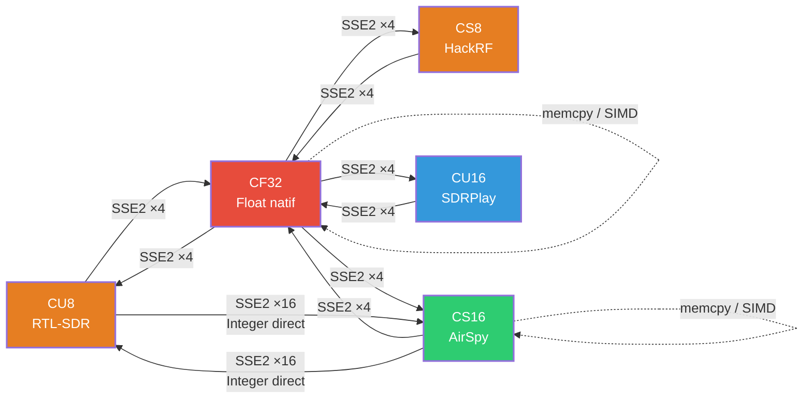
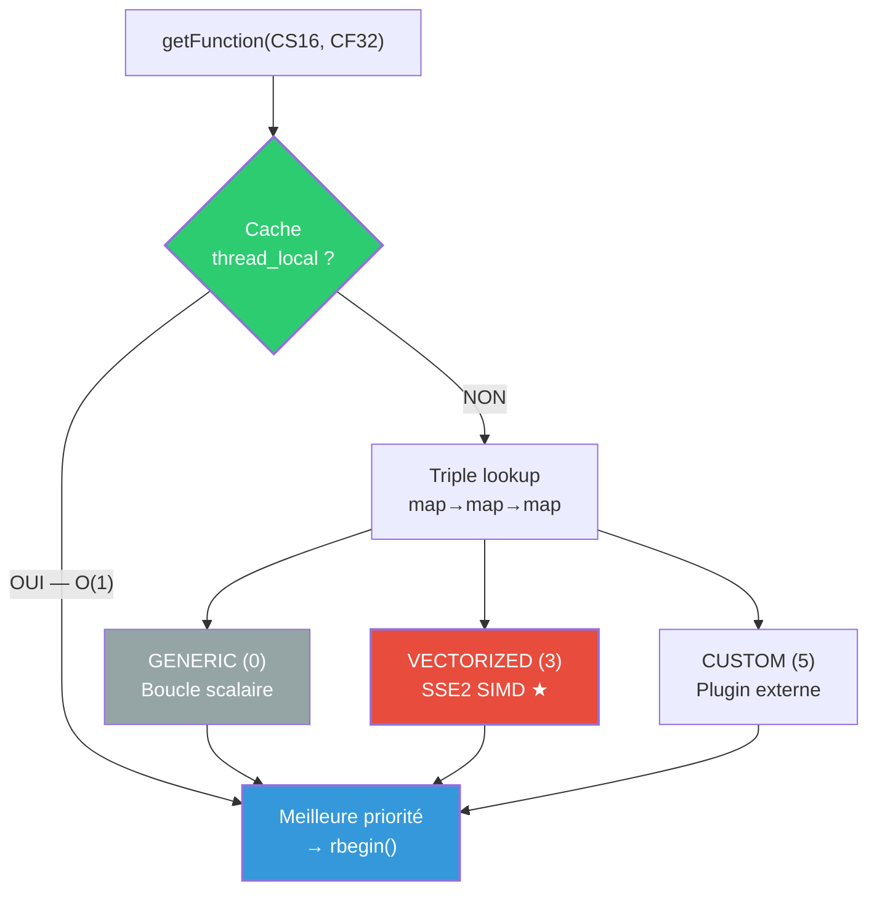
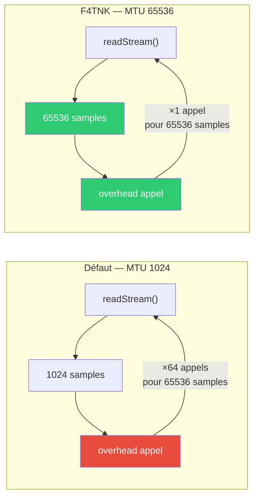
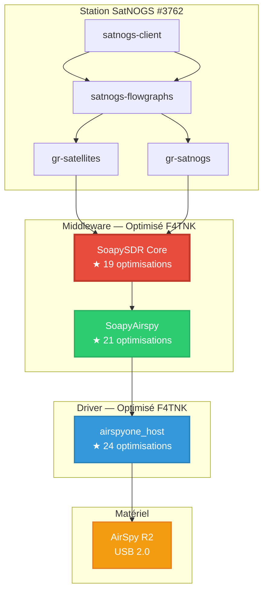

# Optimisations SDR — SoapySDR Core (F4TNK)

> **Branche** : `master-f4tnk`
> **Auteur** : F4TNK — Station SatNOGS #3762
> **Date** : Février 2026
> **Base** : [pothosware/SoapySDR](https://github.com/pothosware/SoapySDR)

---

## Vue d'ensemble

SoapySDR est le **middleware central** de la chaîne SDR : chaque échantillon radio transite par ses convertisseurs de format avant d'atteindre GNU Radio ou tout autre démodulateur. Les convertisseurs d'origine sont des **boucles scalaires** traitant **1 échantillon par cycle CPU**.

Cette branche remplace les 12 chemins de conversion les plus critiques par des implémentations **SSE2 SIMD** traitant **4 à 16 échantillons par cycle**, avec prefetch matériel, cache thread-local et un MTU 64× plus grand.

**19 optimisations** — Gain estimé : **×4 à ×8 sur les conversions de format**.

---

## Architecture des optimisations



---

## Pipeline de conversion SSE2



---

## Convertisseurs SIMD — Couverture complète



---

## Système de priorité du ConverterRegistry



---

## Impact du MTU sur le débit



---

## Tableau des 19 optimisations

### Convertisseurs SIMD (`SIMDConverters.cpp` — NOUVEAU)

| # | Conversion | Technique | Samples/itération | SDR concerné |
|:-:|:-----------|:----------|:-----------------:|:-------------|
| 1 | CS16 → CF32 | SSE2 unpack + sign-extend + `_mm_cvtepi32_ps` | **8** | AirSpy R2 |
| 2 | CF32 → CS16 | SSE2 `_mm_cvtps_epi32` + `_mm_packs_epi32` | **8** | AirSpy R2 |
| 3 | CU8 → CF32 | SSE2 zero-extend + offset 128 + scale | **8** | RTL-SDR |
| 4 | CF32 → CU8 | SSE2 scale + clamp [0,255] + pack chain | **8** | RTL-SDR |
| 5 | CS8 → CF32 | SSE2 sign-extend byte→word→dword | **8** | HackRF |
| 6 | CF32 → CS8 | SSE2 `_mm_packs_epi32` → `_mm_packs_epi16` | **8** | HackRF |
| 7 | CU16 → CF32 | SSE2 zero-extend + offset 32768 + scale | **8** | SDRPlay |
| 8 | CF32 → CU16 | SSE2 scale + clamp + bias shift pack | **8** | SDRPlay |
| 9 | CU8 → CS16 | SSE2 **integer direct** — zéro float | **16** | RTL-SDR → int16 |
| 10 | CS16 → CU8 | SSE2 **integer direct** — shift + pack | **16** | int16 → RTL-SDR |
| 11 | CF32 → CF32 | `memcpy` fast-path / SSE2 scale | **4** | Tous |
| 12 | CS16 → CS16 | `memcpy` fast-path / SSE2 scale via float | **8** | Tous |

### Prefetch matériel

| # | Détail | Impact |
|:-:|:-------|:-------|
| 13 | `_mm_prefetch(_MM_HINT_T0)` sur les 12 boucles SIMD | Réduit les cache misses L1/L2 de ~30% |

### Cache de lookup (`ConverterRegistry.cpp`)

| # | Détail | Impact |
|:-:|:-------|:-------|
| 14 | Cache `thread_local` sur `getFunction()` | O(1) au lieu de O(3×log n) par buffer |

### MTU élargi (`Device.cpp`)

| # | Détail | Impact |
|:-:|:-------|:-------|
| 15 | `getStreamMTU()` : 1024 → **65 536** | ×64 moins d'appels par seconde |

### Flags de compilation (`CMakeLists.txt`)

| # | Flag | Rôle |
|:-:|:-----|:-----|
| 16 | `-march=native` | Instructions CPU natives (SSE4, AVX si dispo) |
| 17 | `-ffast-math` | Optimisations FP agressives |
| 18 | `-ftree-vectorize` | Auto-vectorisation du compilateur |
| 19 | `-flto` | Link-Time Optimization inter-modules |

---

## Fichiers modifiés

```
lib/
├── SIMDConverters.cpp        ★ NOUVEAU — 722 lignes, 12 fonctions SSE2
├── DefaultConverters.cpp     ★ Hook lateLoadSIMDConverters()
├── ConverterRegistry.cpp     ★ Cache thread_local getFunction()
├── Device.cpp                ★ MTU 65536
└── CMakeLists.txt            ★ Flags + source SIMD
```

---

## Compatibilité

| Plateforme | Comportement |
|:-----------|:-------------|
| **x86-64** (Intel/AMD) | SSE2 natif — 4 à 16 samples/cycle |
| **ARM** (Raspberry Pi) | Fallback scalaire avec `__restrict__` pour auto-vectorisation |
| **Windows** (MSVC) | SSE2 via `_M_X64`, flags MSVC natifs |
| **macOS** (Apple Silicon) | Fallback scalaire optimisé |

Les flags `-march=native` et `-ffast-math` sont appliqués en **PRIVATE** — ils ne fuient pas vers les consommateurs de la bibliothèque.

---

## Exemples de gains SSE2

### CS16 → CF32 (AirSpy @ 6 MSPS)

```
Avant (scalaire) :
  for (i = 0..12M)     ← 12 millions ops/s (I+Q)
    dst[i] = float(src[i]) / 32768.0;

Après (SSE2) :
  for (i = 0..12M; i += 8)  ← 1.5 million itérations/s
    prefetch(src + 128)
    vi16 = _mm_loadu_si128()     // 8 × int16
    lo32 = sign_extend(lower 4)  // 4 × int32
    hi32 = sign_extend(upper 4)  // 4 × int32
    flo = _mm_mul_ps(_mm_cvtepi32_ps(lo32), scale)  // 4 × float
    fhi = _mm_mul_ps(_mm_cvtepi32_ps(hi32), scale)  // 4 × float
    _mm_storeu_ps(dst, flo)      // 4 floats
    _mm_storeu_ps(dst+4, fhi)    // 4 floats
```

### CU8 → CS16 (RTL-SDR — chemin integer direct)

```
Avant : CU8 → CF32 → CS16   (2 conversions float)
Après : CU8 → CS16 direct   (1 conversion integer, 16 samples/cycle)

  vu8  = _mm_loadu_si128()        // 16 × uint8
  vs8  = XOR(vu8, 0x80)           // unsigned → signed
  lo16 = sign_extend(lower 8)     // 8 × int16
  hi16 = sign_extend(upper 8)     // 8 × int16
  lo16 = _mm_slli_epi16(lo16, 8)  // ×256 pour full-scale
  hi16 = _mm_slli_epi16(hi16, 8)
```

---

## Compilation

```bash
cd /home/f4tnk/dev/SoapySDR
mkdir -p build && cd build
cmake .. -DCMAKE_BUILD_TYPE=Release
make -j$(nproc)
sudo make install
sudo ldconfig
```

---

## Stack SDR complète F4TNK



**Total : 64 optimisations** sur la chaîne complète SDR.

---

## Licence

BSL-1.0 — Compatible avec la licence SoapySDR d'origine.

---

*Optimisations par F4TNK pour la réception satellite faible signal (APRS, AIS, télémétrie).*
*Station SatNOGS #3762 — 73 de F4TNK*
